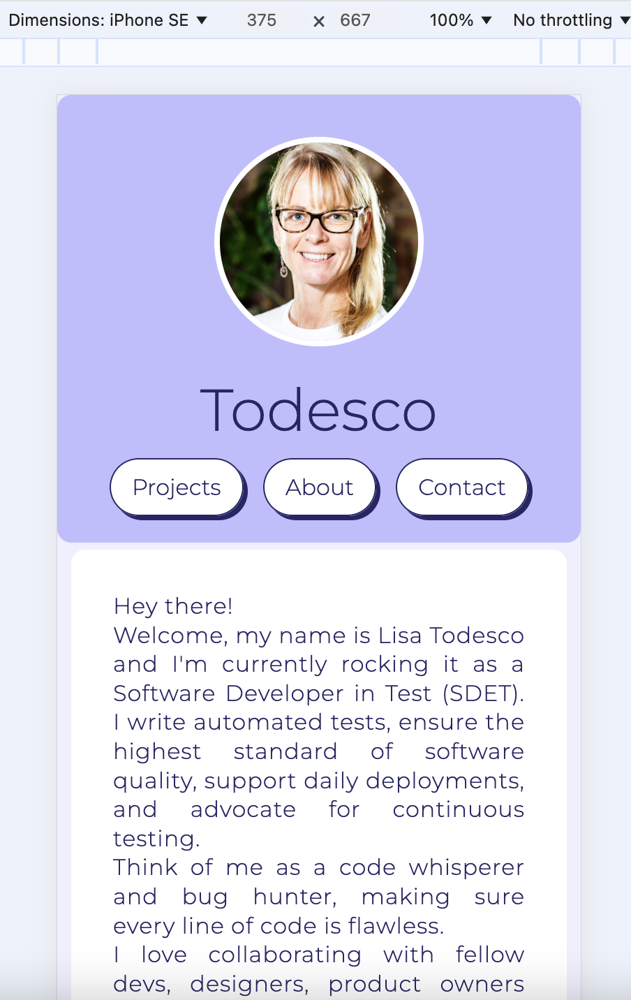
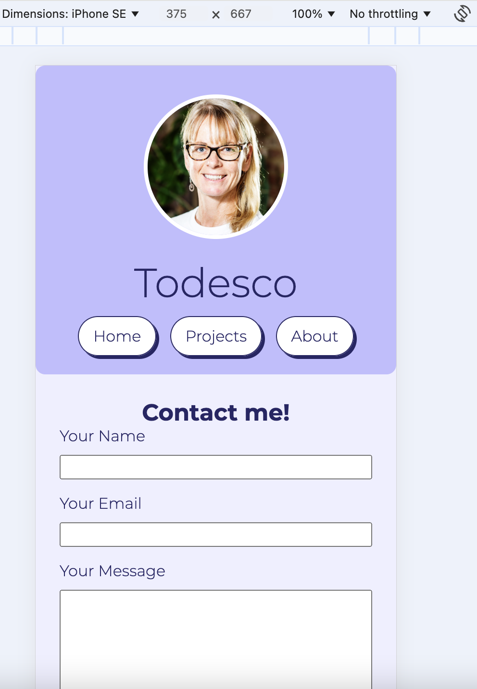
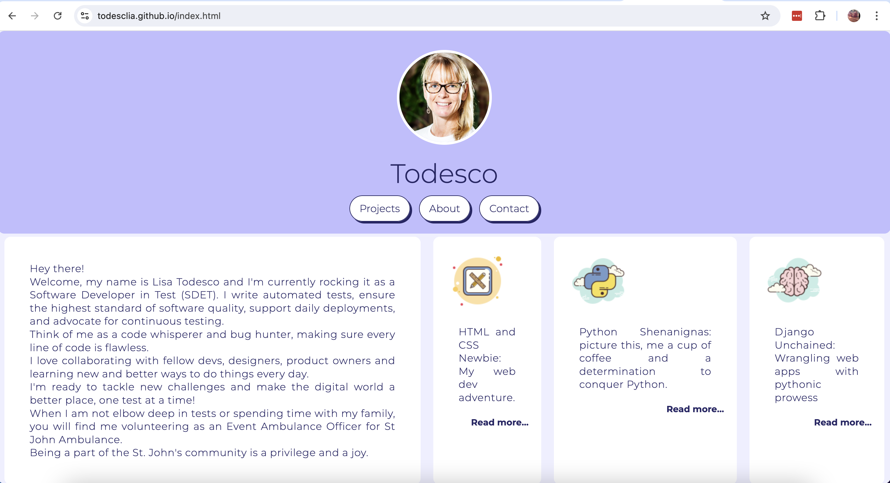
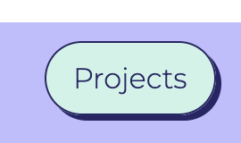
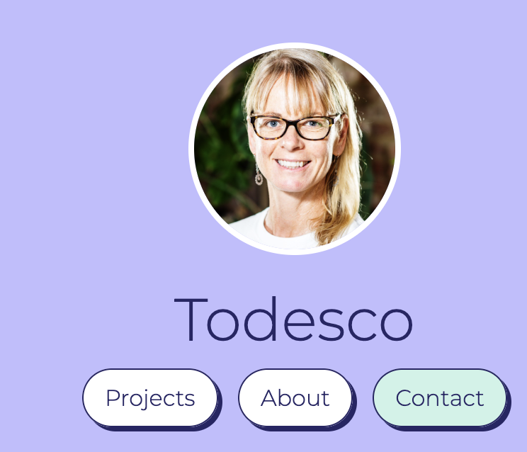

#  Lisa Todesco - Portfolio Task
​
[My portfolio site] https://todesclia.github.io/

### Content
The project includes several key features designed to provide a comprehensive and engaging user experience. A profile picture is prominently displayed to personalize the site and create a visual connection with visitors. The biography section, consisting of at least 100 words, offers a detailed introduction, adding depth and context about the individual or organization behind the site. A functional contact form is implemented to facilitate easy communication, allowing users to reach out directly through the website. The "Projects" section showcases various works or initiatives, providing detailed descriptions and visual representations to engage and inform visitors. Additionally, links to external sites such as GitHub and LinkedIn are included to offer visitors easy access to related profiles and further information.
​
### Technical
The project is designed with three web pages: an About page, a Projects page and a Contacts page, which help organize content and provide users with clear, distinct sections for information about the site and its projects. Version control with Git is utilized to track changes, and maintain a history of the project's development. The application is deployed on GitHub Pages, leveraging its seamless integration with Git repositories for easy and reliable hosting. Responsive design principles are implemented to ensure the web pages render well on various devices and screen sizes, achieved through flex-box grids, flexible images, and media queries. Finally, the project uses semantic HTML to enhance accessibility, readability, and SEO by employing tags like header, nav, section, article, and footer to clearly define the structure and meaning of the content.

### Bonus (optional)    
The project also includes interactive styles to enhance user experience and accessibility. Specifically, different styles for active, hover, and focus states are implemented to provide visual feedback to users. For example, when users hover over articles, the color changes, indicating that the element is interactive and can be clicked. This design decision improves the usability of the web pages by making it clear which elements are actionable, thereby enhancing the overall user experience. Additionally, these interactive styles contribute to better accessibility by providing visual cues for users navigating the site with a keyboard or other assistive devices. This approach ensures that the website is not only aesthetically pleasing but also functional and inclusive.
​
### Screenshots
 
> 
> You can do this by saving the images in a folder in your repo, and including them in your readme document with the following Markdown code: 

####  image_title_goes_here 

